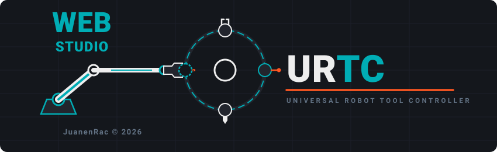

<p align="center">
  
</p>

# URTC Web Studio

<p align="center">
  <a href="README.md">🇺🇸 English</a> |
  <a href="README_spa.md">🇪🇸 Español</a> |
  🇫🇷 <b>Français</b> |
  <a href="README_ita.md">🇮🇹 Italiano</a> |
  <a href="README_deu.md">🇩🇪 Deutsch</a> |
  <a href="README_zho.md">🇨🇳 简体中文</a> |
  <a href="README_jpn.md">🇯🇵 日本語</a>
</p>


<p align="left">
  
  
  
</p>


Un compagnon basé sur navigateur pour l'**Universal Robot Tool Controller (URTC)** -
une app monopage React/Vite qui parle à du matériel URTC réel via un adaptateur
USB-CAN grâce à la [Web Serial API](https://developer.mozilla.org/en-US/docs/Web/API/Web_Serial_API),
utilisant le même framing SLCAN et le même protocole CAN que les deux outils
compagnons de bureau, [URTC Flasher](https://github.com/JuanenRac/URTC-FLASHER) et
[URTC Tester](https://github.com/JuanenRac/URTC-TESTER). L'objectif est la parité de
fonctionnalités avec ces deux outils au sein d'un seul onglet de navigateur, pas une
démo simplifiée de ceux-ci - les onglets Flasher Studio et Tester Studio envoient et
reçoivent les vraies trames CAN décrites dans `docs/CANBUS.TXT` du
[dépôt firmware d'URTC](https://github.com/JuanenRac/URTC).

---

## 🧭 Ce qui est réel vs. ce qui est un bac à sable

Cette app a deux types d'onglets :

- **Onglets réels, pilotés par le matériel** - Flasher Studio, Tester Studio, et le
  CAN Bus Protocol Analyzer. Ceux-ci ne font quoi que ce soit qu'une fois que vous
  avez connecté un vrai adaptateur USB-CAN (bouton en haut à droite de l'en-tête) ;
  chaque commande qu'ils envoient et chaque lecture qu'ils affichent provient du bus
  CAN réel. Cela inclut la **lecture réelle de la caméra thermique** - le panneau
  « Thermal Inspection » de Tester Studio (`0x250`/`0x251`/`0x254`/`0x255`) interroge
  la matrice IR MLX90640 réelle de la tête d'outil via CAN.
- **Onglets bac à sable hors ligne** - Control (catalogue d'outils), OLED, Specs/BOM,
  et Thermal IR Inspection. Ceux-ci vous permettent d'explorer le catalogue de 25
  outils, prévisualiser les écrans d'état OLED, parcourir le BOM/pinouts, et voir un
  flux de caméra thermique simulé, tout cela sans aucun matériel connecté. Le
  commutateur « FW v0.0 / v0.1 » de l'en-tête n'affecte que ces onglets bac à sable
  (quels profils d'outils un build de firmware donné débloquerait) - il n'a aucun
  rapport avec ce que rapporte une carte réelle connectée.
  - **Ne confondez pas les deux vues thermiques** : l'onglet autonome « Thermal IR
    Inspection » (`ThermalCameraViewer.tsx`) est du bruit `Math.random()` à 100%
    côté client, sans aucun trafic CAN - c'est une maquette d'interface, pas une
    lecture de capteur. Les vraies données MLX9064x n'apparaissent que dans le
    panneau « Thermal Inspection » de Tester Studio, et seulement une fois le
    matériel connecté.

## 🔌 Matériel nécessaire

- Un adaptateur USB-CAN exécutant le firmware **SLCAN** (p. ex. un CANable
  exécutant `candlelight`/`slcan`, ou tout adaptateur parlant le protocole série
  SLCAN `lawicel` standard) - la même classe d'adaptateur que les deux outils de
  bureau supportent via leur propre transport Série.
- Le bus réglé à **500 kbit/s** (cette app ne détecte pas automatiquement le débit
  binaire comme le fait le flag `--auto-detect` des outils de bureau ; elle ouvre
  toujours à 500k).
- Un navigateur avec support Web Serial - **Chrome ou Edge**. Firefox et Safari
  n'implémentent pas Web Serial et ne pourront pas se connecter du tout.
- Web Serial nécessite soit un contexte sécurisé (HTTPS) soit `localhost` - et ne
  peut pas être utilisé depuis l'intérieur d'un iframe. Si vous prévisualisez cette
  app dans un cadre intégré, ouvrez-la d'abord dans son propre onglet.

## ⚡ Flasher Studio - couverture réelle des fonctionnalités

Porté depuis le propre `flasher_protocol.py` d'`URTC-FLASHER`, contre les mêmes
CAN ID :

- **Mise à jour CAN-OTA de la carte principale** (`0x7F0`-`0x7F7`) : déclencheur
  d'entrée dans le bootloader, signature HMAC-SHA256, transfert paginé avec
  contrôle de flux par ACK de page et retry/backoff, CRC32 + END_UPDATE avec
  version déclarée, et gestion de statut terminal (y compris la récupération d'une
  trame de confirmation perdue de la même manière que l'outil de bureau - il
  réinterroge la version plutôt que de signaler un faux échec).
- **Mise à jour CAN-OTA de l'esclave d'extension** (`0x210`-`0x219`, relayée via le
  propre pont I2C de la carte principale) - même schéma de signature/CRC, aucun
  ACK de page ni battement de cœur sur ce chemin (correspond au protocole réel ; la
  progression est interrogée, pas poussée).
- **Autorisation de downgrade** (`0x7FD`) - une case à cocher protégée par
  confirmation qui autorise la tentative actuelle à contourner le contrôle
  anti-rollback du bootloader, pour un retour délibéré à une version plus
  ancienne.
- **Effacement F-RAM avant flashage** (`0x192`), optionnel, carte principale
  uniquement.
- **Requête compteur d'erreurs CAN** (`0x7FB`/`0x7FC`, TEC/REC lus directement
  depuis les propres registres d'erreur du contrôleur CAN) - distingue un vrai
  problème de bus d'un problème côté application/bootloader.
- **Relecture/sauvegarde firmware via CAN** (`0x7FE`/`0x7FF`) - relit le contenu
  actuel de l'emplacement principal avant que vous ne l'écrasiez, au rythme de
  2KB/page avec ACK de l'hôte, et l'enregistre sous forme de téléchargement `.bin`.
- **Requête de version de carte en direct** (`0x7F8`/`0x7F9`/`0x7FA`) - affiche le
  vrai répondant (application ou bootloader), le HardwareID, et la version, pas un
  commutateur simulé.
- **Support sidecar `<file>.manifest.json`** - lors du flashage d'un fichier venant
  de la liste firmware GitHub (ou du dossier local `public/firmware/`), la version
  déclarée d'un manifest correspondant a priorité pour signaler ce qui est en
  cours d'installation, et son `sha256` (si présent) est vérifié comme un
  avertissement de bon sens précoce et non bloquant - même comportement que le
  `_check_manifest` de l'outil de bureau.
- **Configuration de carte** : type de carte d'extension / variante de capteur
  MLX9064x / configuration d'outil libre (broches ID `11111`) / infos périphérique
  et numéro de série - `0x1A0`-`0x1A7`.

### SWD/JTAG - non disponible depuis un navigateur, par conception

Il n'existe aucune API web capable de piloter une sonde de débogage SWD/JTAG - Web
Serial ne parle qu'à des périphériques à framing série (comme un adaptateur
USB-CAN), pas au protocole propre d'une sonde, et STM32CubeProgrammer/pyOCD sont
des sous-processus natifs que l'outil de bureau exécute. C'est une limitation
structurelle de l'exécution dans un bac à sable navigateur, pas une fonctionnalité
manquante ici. L'onglet SWD/JTAG dans Flasher Studio explique les commandes
exactes que l'outil de bureau `URTC Flasher` exécuterait localement, à titre de
référence - utilisez cet outil directement pour la programmation à puce complète,
les vérifications option-byte/RDP, ou une sauvegarde complète de la flash avant un
effacement de masse.

## 🧰 Tester Studio - couverture réelle des fonctionnalités

Porté depuis les propres `tester_tool_panels.py` /
`tester_common_panels.py` d'`URTC-TESTER`, contre les mêmes CAN ID :

- Un panneau par outil (fer à souder + dévidoir de fil, outils de mouvement à
  moteur pas-à-pas simple partagés, ramassage par vide, perceuse, AOI, laser,
  chauffage/mouvement/ventilateurs d'imprimante 3D, sonde de balayage,
  électroaimant, soudeuse par points/ultrasons, sonde volante incl. le chemin
  avancé ADS1115, séchage UV, retravail à air chaud, sertissage, inspection
  thermique, distribution de pâte), chacun envoyant les octets de commande réels
  de l'outil et décodant sa télémétrie réelle.
- **Case active + keepalive** pour chaque outil avec un watchdog de communication
  côté firmware (fer à souder, laser, séchage UV, retravail à air chaud, buse
  d'imprimante 3D - renvoi toutes les 150ms sous un watchdog de 250ms ; ventilateur
  de couche d'imprimante 3D - renvoi toutes les 400ms sous son propre watchdog de
  1000ms), correspondant exactement au timing propre de l'outil de bureau.
- **Global Controls** (`0x100`), passthrough SPI de **Expansion Board** + requête
  TMC DIAG0 (`0x180`-`0x183`), requête/effacement **F-RAM** (`0x190`-`0x192`),
  **Self-Test** (vérifications sûres, au repos, par outil), un **Raw Bus Monitor**
  avec export de trace `.trc`/`.asc`, et un injecteur **Custom Frame** avec un
  intervalle de répétition optionnel - validé de la même manière que le propre
  injecteur de trames du CAN Bus Protocol Analyzer : l'ID est masqué à la plage
  standard CAN de 11 bits, et les jetons de données sont filtrés en octets
  hexadécimaux valides avant d'être plafonnés à la limite de 8 octets du payload
  CAN.
- **Detect Hardware** interroge le vrai outil actif (`0x110`/`0x111`) et la
  version de carte (`0x7F8`/`0x7F9`), et une erreur critique déclarée (`0x111`
  octet 1) apparaît comme une bannière de défaut en direct.

## 🔐 Note de sécurité : la clé de signature OTA

Comme l'`URTC Flasher` de bureau, cette app est livrée avec la clé de signature
HMAC-SHA256 par défaut du projet commise dans le code source
(`src/lib/flasher.ts`) - la propre clé anti-falsification du bootloader qui
détermine si une mise à jour CAN-OTA est acceptée. C'est une correspondance
intentionnelle avec la propre convention de l'outil de bureau (le `HMAC_KEY` de
`flasher_config.py`, lui-même remplaçable via une configuration locale non
commise), pas un oubli. Cela vient avec un avertissement spécifique à l'exécution
en tant qu'**app web** : contrairement à un exécutable de bureau téléchargé,
quiconque charge cette page peut lire la clé directement depuis le bundle JS
distribué - il n'existe aucun moyen pour une app statique côté client de garder un
secret de signature privé vis-à-vis de ses propres visiteurs. Si vous faites
tourner la vraie clé de signature pour un déploiement de production, ne déployez
cette app que quelque part dont vous contrôlez l'accès (un réseau interne, un VPN,
ou un hôte à accès restreint), ou traitez-la de la même manière que vous
traiteriez la distribution de l'outil Flasher de bureau lui-même - à des
techniciens autorisés, pas à l'internet public.

## 🚀 Pour commencer

### Prérequis
- Node.js (v18+)
- npm

### Installation

```bash
git clone https://github.com/JuanenRac/URTC-WEB-STUDIO.git
cd URTC-WEB-STUDIO
npm install
```

### Mode développement

Exécute l'app avec le serveur de développement de Vite et le rechargement en
direct :
- **Windows :** double-cliquez sur `dev.bat` ou exécutez `npm run dev`
- **Linux/Mac :** exécutez `./dev.sh` ou `npm run dev`

Puis ouvrez `http://localhost:3000` dans Chrome ou Edge.

### Build de production

Compile en un bundle statique et optimisé dans `dist/` :
- **Windows :** double-cliquez sur `build.bat` ou exécutez `npm run build`
- **Linux/Mac :** exécutez `./build.sh` ou `npm run build`

C'est un site statique simple - il n'y a aucun composant serveur intégré
(contrairement au propre `server.ts` d'`HYDRA-UMC STUDIO`). Prévisualisez le
dossier `dist/` compilé localement avec :

```bash
npm run preview
```

ou servez `dist/` avec l'hébergeur de fichiers statiques de votre choix. `npm run
lint` exécute le compilateur TypeScript en mode vérification uniquement.

### Versionnage

Le `version` de `package.json` s'incrémente automatiquement à chaque `npm
run build` réel (branché comme script `prebuild`, qui exécute
`scripts/bump-version.mjs`) - `npm run dev`/`lint`/`preview` n'y touchent
jamais. Ce n'est pas du Semantic Versioning : c'est un compteur kilométrique
en base 10. Le chiffre du patch augmente de 1 ; lorsqu'il dépasserait 9, il
revient à 0 et le chiffre du minor augmente à sa place (`0.1.9` -> `0.2.0`,
jamais `0.1.10`) ; la même retenue se propage du minor au major. Voir
`CHANGELOG.md` pour l'historique des versions et un résumé du travail
antérieur sur ce projet.

## 🛠️ Stack technique
- **Langage :** TypeScript
- **Framework frontend :** React 18
- **Outil de build :** Vite
- **Style :** Tailwind CSS
- **Icônes :** Lucide React
- **CRC32 :** `crc-32` - vérification d'intégrité de l'image firmware, reflète le
  propre calcul de CRC32 du bootloader
- **Transport matériel :** Web Serial API + framing SLCAN (aucune dépendance
  native, aucun serveur backend compagnon)

## 📂 Structure du dépôt

```
/
├── src/
│   ├── App.tsx                     Composant racine - etat des onglets, etat
│   │                                materiel, journalisation des trames CAN, et
│   │                                les gestionnaires cables dans chaque onglet
│   │                                ci-dessous (y compris le
│   │                                demarrage/relecture CAN OTA et le propre
│   │                                injecteur de trames du CAN Bus Analyzer)
│   ├── main.tsx                    Point d'entree Vite/React
│   ├── i18n.ts                     Configuration i18next - en/es/de/fr/it,
│   │                                persistee dans localStorage
│   ├── index.css                   Point d'entree Tailwind
│   ├── types.ts                    Types TypeScript partages (CanFrame,
│   │                                HardwareState, FlasherState,
│   │                                ExpansionBoardType, ...)
│   ├── vite-env.d.ts                Declarations de types ambiants propres a
│   │                                Vite
│   ├── components/
│   │   ├── Header.tsx               Barre superieure : bouton
│   │   │                            connecter/deconnecter, nom de l'outil
│   │   │                            actif, commutateur bac a sable FW v0.0/v0.1
│   │   ├── Sidebar.tsx              Navigation gauche - les 7 onglets decrits
│   │   │                            dans ce README
│   │   ├── ToolCatalog.tsx          Onglet bac a sable : le catalogue de 25
│   │   │                            outils, selection d'outil, controle de
│   │   │                            consigne
│   │   ├── OledDisplay.tsx          Onglet bac a sable : apercu des ecrans
│   │   │                            d'etat OLED
│   │   ├── SpecsAndBomViewer.tsx    Onglet bac a sable : navigateur BOM/pinouts
│   │   ├── ThermalCameraViewer.tsx  Onglet bac a sable : flux simule MLX90640 -
│   │   │                            100% Math.random(), aucun trafic CAN (voir
│   │   │                            "Ce qui est reel vs. ce qui est un bac a
│   │   │                            sable" ci-dessus)
│   │   ├── HardwarePanel.tsx        Panneau bac a sable de controle
│   │   │                            cavaliers/LED/carte d'extension, utilise
│   │   │                            dans les onglets Control et OLED
│   │   ├── CanBusAnalyzer.tsx       Onglet reel : journal de trames CAN brutes,
│   │   │                            injecteur de trame personnalisee,
│   │   │                            declencheurs de commande preetablis
│   │   ├── FlasherStudio.tsx        Onglet reel : interface CAN-OTA (principale
│   │   │                            + esclave d'extension) et l'explicateur de
│   │   │                            capacite SWD/JTAG
│   │   ├── TesterStudio.tsx         Onglet reel : controle/telemetrie en
│   │   │                            direct par outil, construit depuis le
│   │   │                            dossier tester/ ci-dessous
│   │   └── tester/
│   │       ├── ToolPanels.tsx       Un panneau par profil d'outil - octets de
│   │       │                        commande reels, decodage de telemetrie
│   │       │                        reelle, keepalive watchdog par outil
│   │       ├── GlobalPanels.tsx     Global Controls, Expansion Board, F-RAM,
│   │       │                        Self-Test, Raw Bus Monitor, injecteur
│   │       │                        Custom Frame
│   │       └── shared.tsx           Primitives UI partagees (Section, Field,
│   │                                classes bouton/input, safeInt)
│   ├── data/
│   │   └── toolsData.ts             Les 25 TOOL_PROFILES - noms, valeurs par
│   │                                defaut, icones pour les onglets bac a
│   │                                sable
│   ├── hooks/
│   │   ├── useSerialCanBus.ts       Transport Web Serial + SLCAN -
│   │   │                            connecter/deconnecter, TX/RX de trames,
│   │   │                            waitForFrame par ID avec un buffer rx
│   │   │                            borne et un plafond de file de 500 trames
│   │   ├── useFlasher.ts            Machine a etats CAN-OTA (carte principale
│   │   │                            + esclave d'extension), reflete
│   │   │                            flasher_protocol.py
│   │   └── useKeepalive.ts          Hook de renvoi a intervalle fixe qui
│   │                                soutient le keepalive watchdog de la case
│   │                                active de chaque outil
│   ├── lib/
│   │   ├── flasher.ts               Constantes du protocole OTA, la cle de
│   │   │                            signature HMAC-SHA256 commise, helpers
│   │   │                            CRC32/HMAC, parsing de manifest
│   │   └── canIds.ts                Constantes de CAN ID pour Tester Studio -
│   │                                 reflete tester_config.py octet par octet
│   └── locales/                     Chaines UI - en.json, es.json, de.json,
│                                     fr.json, it.json, ja.json, zh.json
├── scripts/
│   └── bump-version.mjs             Script d'incrementation de version sans dependance,
│                                     execute automatiquement avant chaque build reel
│                                     (voir "Versionnage" ci-dessus)
├── public/
│   └── firmware/                    .bin/.elf/.hex embarques pour
│                                     l'application principale, le bootloader
│                                     principal, l'application esclave
│                                     d'extension, et le bootloader esclave
│                                     d'extension
├── images/
│   ├── URTC_WEB_STUDIO_BANNER.svg   Banniere de logo complete (affichee en
│                                     haut de ce README)
│   ├── URTC_APP_ICON_NEW.svg        Icone de l'app
│   ├── urtc_custom_icon.svg         Icone de l'app, meme illustration
│   └── urtc_icon.ico                Favicon
├── index.html                       HTML d'entree Vite
├── metadata.json                    Nom/description de l'app + permission
│                                     "serial" demandee (utilisee par la
│                                     plateforme d'hebergement)
├── vite.config.ts                   Configuration Vite + plugin Tailwind
├── tsconfig.json                    Configuration TypeScript
├── .env.example                     VITE_APP_TITLE
├── dev.bat / dev.sh                 Installe les dependances + demarre le
│                                     serveur de developpement Vite
├── build.bat / build.sh             Installe les dependances + produit le
│                                     build statique de dist/
├── tools/
│   └── ci_validate.py               Validation manifest/CHANGELOG/docs utilisée par la CI
├── bump_manifest_version.py         Synchronise la version de hydra-umc.project.json avec la version native (--sync)
├── package.json
├── CHANGELOG.md                     Historique des versions et resume du travail passe
├── LICENSE
├── README.md                        Ce fichier
├── docs/
│   ├── ARCHITECTURE.md
│   ├── BUILD_AND_RUN.md
│   └── INTEGRATION_CONTRACT.md
└── README_spa.md / README_ita.md / README_fra.md / README_deu.md / README_zho.md / README_jpn.md  <- traductions
```

## 📜 LICENCE

URTC Web Studio est (c) 2026 JuanenRac (Electro Hobby 3D). Cet avis doit être
inclus dans toute distribution de ce projet ou de ses travaux dérivés.

Ce projet consiste en du code source et sa propre documentation, disponibles sous
des licences différentes - chacune adaptée à ce qu'elle couvre réellement :

1. Le code source (tout ce qui se trouve sous `src/`, plus la configuration
   Vite/TypeScript qui le compile) est disponible sous la **GNU General Public
   License v3.0 (GPL-3.0)**. Texte complet sur
   https://www.gnu.org/licenses/gpl-3.0.html.

2. La documentation (ce README et ses propres traductions - `README_spa.md`,
   `README_ita.md`, `README_fra.md`, `README_deu.md`, `README_zho.md`,
   `README_jpn.md`) est disponible sous
   **Creative Commons Attribution-ShareAlike 4.0 International (CC BY-SA 4.0)**.
   Texte complet sur https://creativecommons.org/licenses/by-sa/4.0/.

Cet outil est le compagnon basé sur navigateur du projet
[URTC (Universal Robot Tool Controller)](https://github.com/JuanenRac/URTC) - voir
le propre dépôt de ce projet pour le firmware de la carte, les conceptions
matérielles, et la documentation complète du protocole contre lequel cet outil
fonctionne. Le propre firmware d'URTC est GPL-3.0 et ses conceptions matérielles
sont CERN-OHL-S v2 ; la propre licence de cet outil ici ne s'étend pas à ce projet
séparé, et vice-versa. Il existe aussi 2 alternatives natives de bureau couvrant le
même terrain :
[URTC Flasher](https://github.com/JuanenRac/URTC-FLASHER) et
[URTC Tester](https://github.com/JuanenRac/URTC-TESTER).

Si vous construisez sur ce projet, gardez la séparation des licences à l'esprit :
les modifications de code devraient rester GPL-3.0, les dérivés de documentation
devraient rester CC BY-SA - chacun avec une attribution à ce projet et son auteur.

## 🔗 Projets Liés

Ce projet fait partie de l'écosystème robotique HYDRA-UMC du même auteur (JuanenRac / Electro Hobby 3D). Bon à savoir, car une demande pourrait en réalité concerner l'un de ceux-ci plutôt que ce dépôt.

**Projet Parent**
- **[URTC](https://github.com/JuanenRac/URTC)** — firmware pour la carte physique Universal Robot Tool Controller, plus de 25 profils d'outil sur bus CAN ; le parent dont ce dépôt est un outil spécifique, au sein de sa propre famille d'outils CAN-bus.

**Projets Frères** — les autres outils de la propre famille d'outils CAN-bus d'URTC
- **[URTC-FLASHER](https://github.com/JuanenRac/URTC-FLASHER)** — outil de bureau à interface graphique pour flasher les cartes URTC, CAN-OTA plus SWD/JTAG puce complète — même protocole SLCAN/CAN que cette application basée sur navigateur, qui en est l'alternative sans installation.
- **[URTC-TESTER](https://github.com/JuanenRac/URTC-TESTER)** — outil de bureau de diagnostic CAN-bus en direct pour cartes URTC, un panneau par profil d'outil — même protocole SLCAN/CAN que cette application basée sur navigateur, qui en est l'alternative sans installation.

**Directement Liés**
- **[HYDRA-UMC-TOOL-CLI](https://github.com/JuanenRac/HYDRA-UMC-TOOL-CLI)** — CLI de flotte avec un vrai contrat de codes de sortie stable, un vrai client en direct de la propre API de HYDRA-UMC-SERVER — une alternative en ligne de commande à cet outil basé sur navigateur.

**Fait Également Partie de l'Écosystème**

*Matériel & Plateforme de Base*
- **[HYDRA-UMC](https://github.com/JuanenRac/HYDRA-UMC)** — la carte mère physique du bras robotique : hôte CM5 + coprocesseur STM32H745 double cœur, coordonnant jusqu'à 8 bras-outils via CAN-OTA/SPI-OTA.
- **[HYDRA-UMC-OS](https://github.com/JuanenRac/HYDRA-UMC-OS)** — couche produit reproductible sur Raspberry Pi OS pour le CM5 : agent en lecture seule, config/profils validés, provisionnement WiFi de premier contact.
- **[HYDRA-UMC-SDK](https://github.com/JuanenRac/HYDRA-UMC-SDK)** — le contrat JSON-Schema partagé et la barrière de sécurité contre laquelle chaque bridge valide ses commandes.

*Backend Central & Clients*
- **[HYDRA-UMC-SERVER](https://github.com/JuanenRac/HYDRA-UMC-SERVER)** — le vrai backend headless (REST/WebSocket) auquel parle réellement chaque client de contrôle.
- **[HYDRA-UMC-STUDIO](https://github.com/JuanenRac/HYDRA-UMC-STUDIO)** — tableau de bord de contrôle web avec visualisation 3D multi-robot en temps réel.
- **[HYDRA-UMC-SUITE](https://github.com/JuanenRac/HYDRA-UMC-SUITE)** — centre de commande d'essaim de bureau (PySide6) pour plusieurs serveurs à la fois, empaqueté en exécutable autonome.
- **[HYDRA-UMC-ANDROID-CONTROL](https://github.com/JuanenRac/HYDRA-UMC-ANDROID-CONTROL)** — application de contrôle Android native avec connexion biométrique et un compagnon Wear OS jumelé.
- **[HYDRA-UMC-IOS-CONTROL](https://github.com/JuanenRac/HYDRA-UMC-IOS-CONTROL)** — application de contrôle iOS/iPadOS (Flutter) avec synchronisation WebSocket en temps réel.
- **[HYDRA-UMC-DSI](https://github.com/JuanenRac/HYDRA-UMC-DSI)** — interface tactile native pour l'écran tactile DSI 7" embarqué, intégrée directement sur le CM5.
- **[HYDRA-UMC-EDITOR-URDF](https://github.com/JuanenRac/HYDRA-UMC-EDITOR-URDF)** — créateur/éditeur graphique de bureau pour URDF qui envoie les modèles terminés vers le propre catalogue de STUDIO.
- **[HYDRA-UMC-BRIDGE-AMR](https://github.com/JuanenRac/HYDRA-UMC-BRIDGE-AMR)** — frontière de coordination pour les flottes AGV/AMR via un éditeur MQTT VDA 5050 réel.
- **[HYDRA-UMC-BRIDGE-CNC](https://github.com/JuanenRac/HYDRA-UMC-BRIDGE-CNC)** — coordinateur haut niveau pour cellules CNC avec accès réel au statut/octets de contrôle GRBL.
- **[HYDRA-UMC-BRIDGE-DROIDS](https://github.com/JuanenRac/HYDRA-UMC-BRIDGE-DROIDS)** — frontière de coordination pour droïdes à pattes/humanoïdes, avec un véritable émetteur de commandes Boston Dynamics Spot.
- **[HYDRA-UMC-BRIDGE-LASER](https://github.com/JuanenRac/HYDRA-UMC-BRIDGE-LASER)** — coordinateur de sécurité pour cellules laser lisant 3 vraies sécurités GPIO de clé/enceinte/verrouillage.
- **[HYDRA-UMC-BRIDGE-OPENPNP](https://github.com/JuanenRac/HYDRA-UMC-BRIDGE-OPENPNP)** — coordinateur haut niveau sûr pour le flux de cartes du pick-and-place OpenPnP.
- **[HYDRA-UMC-BRIDGE-PRINTER3D](https://github.com/JuanenRac/HYDRA-UMC-BRIDGE-PRINTER3D)** — frontière de coordination sûre pour imprimantes 3D Moonraker/Klipper, avec de vraies commandes de tâche contrôlées.
- **[HYDRA-UMC-BRIDGE-ROS2](https://github.com/JuanenRac/HYDRA-UMC-BRIDGE-ROS2)** — coordinateur de sécurité avec un vrai transport ROS 2 rclpy à importation paresseuse.
- **[HYDRA-UMC-BRIDGE-UAV](https://github.com/JuanenRac/HYDRA-UMC-BRIDGE-UAV)** — frontière de coordination pour UAV équipés de caméra, avec un véritable émetteur de commandes MAVLink.

*Nœud IA de Vision (Hailo-8)*
- **[HYDRA-UMC-VISION-NODE](https://github.com/JuanenRac/HYDRA-UMC-VISION-NODE)** — hub d'intégration pour le pipeline de vision Hailo-8, avec une vraie vérification de disponibilité matérielle par étape.
- **[HYDRA-UMC-DETECTION-HEF](https://github.com/JuanenRac/HYDRA-UMC-DETECTION-HEF)** — registre réel de modèles compilés avec vérification de chargement sécurisé par architecture Hailo/checksum.
- **[HYDRA-UMC-VISION-STREAMER](https://github.com/JuanenRac/HYDRA-UMC-VISION-STREAMER)** — générateur réel de pipeline GStreamer + config MediaMTX, avec une vraie frontière d'intégration HailoRT.
- **[HYDRA-UMC-VISUAL-SERVOING-API](https://github.com/JuanenRac/HYDRA-UMC-VISUAL-SERVOING-API)** — vraie loi de correction Position-Based Visual Servoing, verrouillée sur l'état de zone en amont.
- **[HYDRA-UMC-SAFETY-ZONES](https://github.com/JuanenRac/HYDRA-UMC-SAFETY-ZONES)** — vraie vérification de violation de zone et demande d'E-STOP, avec application de la fraîcheur de calibration.

*Nœud IA Cognitif (Hailo-10)*
- **[HYDRA-UMC-COGNITIVE-NODE](https://github.com/JuanenRac/HYDRA-UMC-COGNITIVE-NODE)** — hub d'intégration pour le pipeline cognitif Hailo-10 (orchestration LLM/VLA/voix).
- **[HYDRA-UMC-VLA-ENGINE](https://github.com/JuanenRac/HYDRA-UMC-VLA-ENGINE)** — vrai encodage/décodage de jetons d'action et génération de trajectoire pour un modèle Vision-Language-Action.
- **[HYDRA-UMC-VOICE-UI](https://github.com/JuanenRac/HYDRA-UMC-VOICE-UI)** — vrai front-end vocal (VAD + analyseur d'intention) avec un relais Watch borné et soumis à confirmation.
- **[HYDRA-UMC-SEMANTIC-PLANNER](https://github.com/JuanenRac/HYDRA-UMC-SEMANTIC-PLANNER)** — vraie décomposition de tâches basée sur des règles et récupération sémantique d'erreurs sur les codes d'erreur MCU.
- **[HYDRA-UMC-DOCS-QA](https://github.com/JuanenRac/HYDRA-UMC-DOCS-QA)** — vraie recherche documentaire TF-IDF (bibliothèque standard uniquement) sur les propres documents Markdown de cet écosystème.

*Orchestration & Essaim*
- **[HYDRA-UMC-ORCHESTRATOR](https://github.com/JuanenRac/HYDRA-UMC-ORCHESTRATOR)** — hub d'intégration avec un vrai contrat de rapport de santé gRPC/Protobuf et une machine à états de mission.
- **[HYDRA-UMC-JOB-DISPATCHER](https://github.com/JuanenRac/HYDRA-UMC-JOB-DISPATCHER)** — vraie file de tâches basée sur la priorité avec déduplication, via une vraie API HTTP.
- **[HYDRA-UMC-NODE-HEALING](https://github.com/JuanenRac/HYDRA-UMC-NODE-HEALING)** — vrai chien de garde de santé de flotte basé sur gRPC, avec retry/backoff et détection d'incohérence d'identité.
- **[HYDRA-UMC-PATH-PLANNER-3D](https://github.com/JuanenRac/HYDRA-UMC-PATH-PLANNER-3D)** — vrai planificateur de trajectoire 3D basé sur RRT, avec vraie validation des collisions obstacle/espace de travail.
- **[HYDRA-UMC-SWARM-SYNC](https://github.com/JuanenRac/HYDRA-UMC-SWARM-SYNC)** — vraie synchronisation d'état CRDT LWW-Element-Map, testée par propriétés pour la convergence multi-cellule.

*Jumeau Numérique & Simulation*
- **[HYDRA-UMC-TWIN](https://github.com/JuanenRac/HYDRA-UMC-TWIN)** — hub d'intégration pour le moteur de jumeau numérique, avec un vrai contrat de synchronisation par compatibilité de version.
- **[HYDRA-UMC-HIL-BRIDGE](https://github.com/JuanenRac/HYDRA-UMC-HIL-BRIDGE)** — vrai verrouillage de sécurité hardware-in-the-loop routant les commandes entre simulation et matériel réel.
- **[HYDRA-UMC-PHYSICS-REPLICA](https://github.com/JuanenRac/HYDRA-UMC-PHYSICS-REPLICA)** — vraie cinématique directe et validation des limites articulaires sur un vrai sous-ensemble URDF.
- **[HYDRA-UMC-SYNTHETIC-DATA-GEN](https://github.com/JuanenRac/HYDRA-UMC-SYNTHETIC-DATA-GEN)** — vrai générateur procédural de scènes 2D avec export d'annotations YOLO/COCO.

*Données & Analytique*
- **[HYDRA-UMC-DATALAKE](https://github.com/JuanenRac/HYDRA-UMC-DATALAKE)** — vrai magasin de séries temporelles basé sur sqlite3, avec une vraie API HTTP d'ingestion/requête.
- **[HYDRA-UMC-ANOMALY-DETECTOR](https://github.com/JuanenRac/HYDRA-UMC-ANOMALY-DETECTOR)** — vrai détecteur d'anomalies FFT + ligne de base statistique, avec surveillance de dérive.
- **[HYDRA-UMC-PRODUCTION-REPORTS](https://github.com/JuanenRac/HYDRA-UMC-PRODUCTION-REPORTS)** — vrai calcul OEE/disponibilité sur l'historique de DATALAKE, avec export CSV reproductible.
- **[HYDRA-UMC-TELEMETRY-COLLECTOR](https://github.com/JuanenRac/HYDRA-UMC-TELEMETRY-COLLECTOR)** — vrai pipeline d'ingestion CAN/WebSocket vers DATALAKE, avec déduplication par séquence.

*Passerelle Industrielle*
- **[HYDRA-UMC-GATEWAY-INDUSTRIAL](https://github.com/JuanenRac/HYDRA-UMC-GATEWAY-INDUSTRIAL)** — hub d'intégration relayant vers les protocoles industriels, avec une vraie couche de liste blanche de commandes/contre-pression.
- **[HYDRA-UMC-OPCUA-SERVER](https://github.com/JuanenRac/HYDRA-UMC-OPCUA-SERVER)** — vrai espace d'adressage OPC-UA, vérifié avec une vraie session client du protocole binaire.
- **[HYDRA-UMC-MQTT-BROKER](https://github.com/JuanenRac/HYDRA-UMC-MQTT-BROKER)** — vrai broker MQTT avec authentification par client optionnelle et ACL de sujets.
- **[HYDRA-UMC-MTCONNECT-ADAPTER](https://github.com/JuanenRac/HYDRA-UMC-MTCONNECT-ADAPTER)** — vrais points de terminaison XML MTConnect `/probe` et `/current`, avec sortie en mode dégradé.

*Outils Complémentaires & Opérations de l'Écosystème*
- **[HYDRA-UMC-DASHBOARD-AI](https://github.com/JuanenRac/HYDRA-UMC-DASHBOARD-AI)** — panneaux Smart Summaries et Anomaly Highlighting sur DATALAKE/ANOMALY-DETECTOR, avec un repli statistique honnête.
- **[HYDRA-UMC-WATCH](https://github.com/JuanenRac/HYDRA-UMC-WATCH)** — application compagnon WearOS avec de vraies alertes haptiques et un relais vocal vers le téléphone jumelé.
- **[URTC-SMART-RACK](https://github.com/JuanenRac/URTC-SMART-RACK)** — firmware pour un rack de montage de cartes avec décodage réel d'ID d'outil et logique de préchauffage Smart Idle.
- **[URTC-VISION-TOOL](https://github.com/JuanenRac/URTC-VISION-TOOL)** — firmware plus un vrai compagnon de vision Python pour une tête d'outil d'inspection thermique/RGB.
- **[HYDRA-UMC-UPDATER](https://github.com/JuanenRac/HYDRA-UMC-UPDATER)** — outil administratif de bureau qui découvre, clone et met à jour chaque dépôt de cet écosystème.

---

## 📚 Documentation & Communauté

- **[CONTRIBUTING.md](CONTRIBUTING.md)** — pile technologique et lignes directrices de codage pour une pull request.
- **[CODE_OF_CONDUCT.md](CODE_OF_CONDUCT.md)** — les normes de comportement attendues dans cette communauté.
- **[SECURITY.md](SECURITY.md)** — comment signaler une vulnérabilité, et les véritables axes de sécurité de ce projet.
- **[SUPPORT.md](SUPPORT.md)** — où poser des questions et signaler des bugs.
- **[LICENSE.md](LICENSE.md)** — la licence propre de ce projet.

## 👤 AUTEUR

**JuanenRac** (Electro Hobby 3D)
📧 electrohobby3d@gmail.com
📺 [youtube.com/@electrohobby3d](https://youtube.com/@electrohobby3d)
