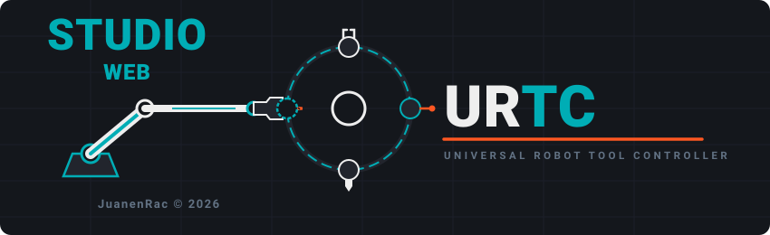

<p align="center">
  
</p>

# URTC Web Studio

<p align="center">
  <a href="README.md">🇺🇸 English</a> |
  🇪🇸 <b>Español</b> |
  <a href="README_fra.md">🇫🇷 Français</a> |
  <a href="README_ita.md">🇮🇹 Italiano</a> |
  <a href="README_deu.md">🇩🇪 Deutsch</a> |
  <a href="README_zho.md">🇨🇳 简体中文</a> |
  <a href="README_jpn.md">🇯🇵 日本語</a>
</p>


<p align="left">
  
  
  
</p>


Un compañero basado en navegador para el **Universal Robot Tool Controller (URTC)** -
una app de una sola página en React/Vite que habla con hardware URTC real a través de
un adaptador USB-CAN mediante la [Web Serial API](https://developer.mozilla.org/en-US/docs/Web/API/Web_Serial_API),
usando el mismo framing SLCAN y el mismo protocolo CAN que las dos herramientas
compañeras de escritorio, [URTC Flasher](https://github.com/JuanenRac/URTC-FLASHER) y
[URTC Tester](https://github.com/JuanenRac/URTC-TESTER). El objetivo es la paridad de
funcionalidades con esas dos herramientas dentro de una sola pestaña del navegador, no
una demo simplificada de ellas - las pestañas Flasher Studio y Tester Studio envían y
reciben las tramas CAN reales descritas en `docs/CANBUS.TXT` del
[repositorio de firmware de URTC](https://github.com/JuanenRac/URTC).

---

## 🧭 Qué es real y qué es una sandbox

Esta app tiene dos tipos de pestañas:

- **Pestañas reales, dependientes de hardware** - Flasher Studio, Tester Studio, y el
  CAN Bus Protocol Analyzer. Estas solo hacen algo una vez que has conectado un
  adaptador USB-CAN real (botón de la cabecera arriba a la derecha); cada comando que
  envían y cada lectura que muestran proviene del bus CAN real. Esto incluye la
  **lectura real de la cámara térmica** - el panel "Thermal Inspection" de Tester
  Studio (`0x250`/`0x251`/`0x254`/`0x255`) consulta el array IR MLX90640 real del
  cabezal de herramienta por CAN.
- **Pestañas sandbox sin conexión** - Control (catálogo de herramientas), OLED,
  Specs/BOM, y Thermal IR Inspection. Estas te permiten explorar el catálogo de 25
  herramientas, previsualizar las pantallas de estado OLED, navegar el BOM/pinouts, y
  ver una alimentación de cámara térmica simulada, todo sin ningún hardware conectado.
  El interruptor "FW v0.0 / v0.1" de la cabecera solo afecta a estas pestañas sandbox
  (qué perfiles de herramienta desbloquearía un build de firmware dado) - no tiene
  ninguna relación con lo que reporta una placa real conectada.
  - **No confundas las dos vistas térmicas**: la pestaña independiente "Thermal IR
    Inspection" (`ThermalCameraViewer.tsx`) es ruido `Math.random()` 100% del lado
    del cliente, sin ningún tráfico CAN en absoluto - es una maqueta de interfaz, no
    una lectura de sensor. Los datos reales de MLX9064x solo aparecen dentro del
    panel "Thermal Inspection" de Tester Studio, y solo una vez que hay hardware
    conectado.

## 🔌 Hardware que necesitas

- Un adaptador USB-CAN ejecutando firmware **SLCAN** (p. ej. un CANable ejecutando
  `candlelight`/`slcan`, o cualquier adaptador que hable el protocolo serie SLCAN
  `lawicel` estándar) - la misma clase de adaptador que soportan ambas herramientas de
  escritorio a través de su propio transporte Serial.
- El bus configurado a **500 kbit/s** (esta app no autodetecta el bitrate de la forma
  en que lo hace el flag `--auto-detect` de las herramientas de escritorio; siempre
  abre a 500k).
- Un navegador con soporte de Web Serial - **Chrome o Edge**. Firefox y Safari no
  implementan Web Serial y no podrán conectar en absoluto.
- Web Serial requiere un contexto seguro (HTTPS) o `localhost` - y no se puede usar
  desde dentro de un iframe. Si estás previsualizando esta app dentro de un frame
  incrustado, ábrela primero en su propia pestaña.

## ⚡ Flasher Studio - cobertura real de funcionalidades

Portado desde el propio `flasher_protocol.py` de `URTC-FLASHER`, contra los mismos
CAN ID:

- **Actualización CAN-OTA de la placa principal** (`0x7F0`-`0x7F7`): disparador de
  entrada al bootloader, firma HMAC-SHA256, transferencia paginada con control de
  flujo por ACK de página y reintento/backoff, CRC32 + END_UPDATE con versión
  declarada, y manejo de estado terminal (incluida la recuperación de una trama de
  confirmación perdida de la misma forma que la herramienta de escritorio - vuelve a
  consultar la versión en vez de reportar un fallo falso).
- **Actualización CAN-OTA del esclavo de expansión** (`0x210`-`0x219`, relevada a
  través del propio puente I2C de la placa principal) - mismo esquema de
  firma/CRC, sin ACK de página ni heartbeat en esta ruta (coincide con el protocolo
  real; el progreso se sondea, no se empuja).
- **Autorización de downgrade** (`0x7FD`) - una casilla protegida por confirmación
  que autoriza al intento actual a saltarse la comprobación anti-rollback del
  bootloader, para un revert deliberado a una versión más antigua.
- **Borrado de F-RAM antes de flashear** (`0x192`), opcional, solo placa principal.
- **Consulta del contador de errores CAN** (`0x7FB`/`0x7FC`, TEC/REC leídos
  directamente de los propios registros de error del controlador CAN) - distingue un
  problema genuino de bus de uno del lado de la aplicación/bootloader.
- **Relectura/respaldo de firmware por CAN** (`0x7FE`/`0x7FF`) - lee el contenido
  actual del slot principal antes de que lo sobrescribas, a un ritmo de 2KB/página
  con ACKs del host, y lo guarda como una descarga `.bin`.
- **Consulta de versión de placa en vivo** (`0x7F8`/`0x7F9`/`0x7FA`) - muestra el
  respondedor real (app o bootloader), HardwareID, y versión, no un interruptor
  simulado.
- **Soporte de sidecar `<file>.manifest.json`** - al flashear un archivo que vino del
  listado de firmware de GitHub (o de la carpeta local `public/firmware/`), la
  versión declarada de un manifest coincidente tiene prioridad al reportar qué se
  está instalando, y su `sha256` (si está presente) se comprueba como una advertencia
  de cordura temprana y no bloqueante - mismo comportamiento que el
  `_check_manifest` de la herramienta de escritorio.
- **Configuración de placa**: tipo de placa de expansión / variante de sensor
  MLX9064x / configuración de herramienta libre (pines ID `11111`) / información de
  periféricos y número de serie - `0x1A0`-`0x1A7`.

### SWD/JTAG - no disponible desde un navegador, por diseño

No existe ninguna API web capaz de manejar una sonda de depuración SWD/JTAG - Web
Serial solo habla con dispositivos de framing serie (como un adaptador USB-CAN), no
con el protocolo propio de una sonda, y STM32CubeProgrammer/pyOCD son subprocesos
nativos que la herramienta de escritorio invoca. Esto es una limitación estructural
de ejecutarse en una sandbox de navegador, no una funcionalidad que falte aquí. La
pestaña SWD/JTAG de Flasher Studio explica los comandos exactos que la herramienta
de escritorio `URTC Flasher` ejecutaría localmente, como referencia - usa esa
herramienta directamente para programación de chip completo, comprobaciones de
option-byte/RDP, o un respaldo de flash completo antes de un borrado masivo.

## 🧰 Tester Studio - cobertura real de funcionalidades

Portado desde los propios `tester_tool_panels.py` /
`tester_common_panels.py` de `URTC-TESTER`, contra los mismos CAN ID:

- Un panel por herramienta (soldador + alimentador de hilo, herramientas de
  movimiento de motor paso a paso compartidas, recogida por vacío, taladro, AOI,
  láser, calentador/movimiento/ventiladores de impresora 3D, sonda de escaneo,
  electroimán, soldador de punto/ultrasonidos, sonda voladora incl. la ruta
  avanzada ADS1115, curado UV, retrabajo con aire caliente, engarzado, inspección
  térmica, dispensado de pasta), cada uno enviando los bytes de comando reales de
  la herramienta y decodificando su telemetría real.
- **Casilla activa + keepalive** para toda herramienta con un watchdog de
  comunicación del lado del firmware (soldador, láser, curado UV, retrabajo con
  aire caliente, boquilla de impresora 3D - reenvío cada 150ms bajo un watchdog de
  250ms; ventilador de capa de impresora 3D - reenvío cada 400ms bajo su propio
  watchdog de 1000ms), coincidiendo exactamente con el timing propio de la
  herramienta de escritorio.
- **Global Controls** (`0x100`), passthrough SPI de **Expansion Board** + consulta
  TMC DIAG0 (`0x180`-`0x183`), consulta/borrado de **F-RAM** (`0x190`-`0x192`),
  **Self-Test** (comprobaciones seguras, en reposo, por herramienta), un
  **Raw Bus Monitor** con exportación de traza `.trc`/`.asc`, y un inyector de
  **Custom Frame** con un intervalo de repetición opcional - validado de la misma
  forma que el propio inyector de tramas del CAN Bus Protocol Analyzer: el ID se
  enmascara al rango estándar CAN de 11 bits, y los tokens de datos se filtran a
  bytes hexadecimales válidos antes de limitarse al máximo de 8 bytes del payload
  CAN.
- **Detect Hardware** consulta la herramienta activa real (`0x110`/`0x111`) y la
  versión de placa (`0x7F8`/`0x7F9`), y un error crítico declarado (`0x111` byte 1)
  aparece como un banner de fallo en vivo.

## 🔐 Nota de seguridad: la clave de firma OTA

Al igual que el `URTC Flasher` de escritorio, esta app se distribuye con la clave de
firma HMAC-SHA256 por defecto del proyecto commiteada en el código fuente
(`src/lib/flasher.ts`) - la propia clave anti-manipulación del bootloader que
determina si se acepta una actualización CAN-OTA. Esto es una coincidencia
intencional con la propia convención de la herramienta de escritorio (el `HMAC_KEY`
de `flasher_config.py`, a su vez sobreescribible mediante una configuración local no
commiteada), no un descuido. Viene con una advertencia específica de ejecutarse como
**app web**: a diferencia de un ejecutable de escritorio descargado, cualquiera que
cargue esta página puede leer la clave directamente del bundle JS distribuido - no
hay forma de que una app estática del lado del cliente mantenga un secreto de firma
privado frente a sus propios visitantes. Si rotas la clave de firma real para un
despliegue de producción, despliega esta app solo en algún sitio cuyo acceso
controles (una red interna, VPN, o host con acceso restringido), o trátalo de la
misma forma en que tratarías la entrega de la propia herramienta Flasher de
escritorio - a técnicos autorizados, no a la internet pública.

## 🚀 Primeros pasos

### Requisitos previos
- Node.js (v18+)
- npm

### Instalación

```bash
git clone https://github.com/JuanenRac/URTC-Web-Studio.git
cd URTC-Web-Studio
npm install
```

### Modo desarrollo

Ejecuta la app con el servidor de desarrollo de Vite y recarga en vivo:
- **Windows:** doble clic en `dev.bat` o ejecuta `npm run dev`
- **Linux/Mac:** ejecuta `./dev.sh` o `npm run dev`

Luego abre `http://localhost:3000` en Chrome o Edge.

### Build de producción

Compila en un bundle estático y optimizado en `dist/`:
- **Windows:** doble clic en `build.bat` o ejecuta `npm run build`
- **Linux/Mac:** ejecuta `./build.sh` o `npm run build`

Este es un sitio estático plano - no hay ningún componente de servidor incluido (a
diferencia del propio `server.ts` de `HYDRA-UMC STUDIO`). Previsualiza la carpeta
`dist/` compilada localmente con:

```bash
npm run preview
```

o sirve `dist/` con cualquier host de archivos estáticos de tu elección. `npm run
lint` ejecuta el compilador de TypeScript en modo de solo comprobación.

### Versionado

El `version` de `package.json` sube automáticamente en cada `npm run build`
real (enganchado como el script `prebuild`, que ejecuta
`scripts/bump-version.mjs`) - `npm run dev`/`lint`/`preview` nunca lo tocan.
Esto no es Semantic Versioning: es un cuentakilómetros en base 10. El dígito
de patch sube en 1; cuando pasaría de 9, se resetea a 0 y el dígito de minor
sube en su lugar (`0.1.9` -> `0.2.0`, nunca `0.1.10`); el mismo acarreo se
propaga de minor a major. Ver `CHANGELOG.md` para el historial de versiones
y un resumen del trabajo anterior en este proyecto.

## 🛠️ Stack tecnológico
- **Lenguaje:** TypeScript
- **Framework de frontend:** React 18
- **Herramienta de build:** Vite
- **Estilos:** Tailwind CSS
- **Iconos:** Lucide React
- **CRC32:** `crc-32` - comprobación de integridad de la imagen de firmware, refleja
  el propio cálculo de CRC32 del bootloader
- **Transporte de hardware:** Web Serial API + framing SLCAN (sin dependencias
  nativas, sin servidor backend compañero)

## 📂 Estructura del repositorio

```
/
├── src/
│   ├── App.tsx                     Componente raiz - estado de pestanas, estado
│   │                                de hardware, registro de tramas CAN, y los
│   │                                manejadores conectados a cada pestana de abajo
│   │                                (incluyendo el inicio/relectura de CAN OTA y
│   │                                el propio inyector de tramas del CAN Bus
│   │                                Analyzer)
│   ├── main.tsx                    Punto de entrada de Vite/React
│   ├── i18n.ts                     Configuracion de i18next - en/es/de/fr/it,
│   │                                persistido en localStorage
│   ├── index.css                   Punto de entrada de Tailwind
│   ├── types.ts                    Tipos TypeScript compartidos (CanFrame,
│   │                                HardwareState, FlasherState,
│   │                                ExpansionBoardType, ...)
│   ├── vite-env.d.ts                Declaraciones de tipos ambientales propias de
│   │                                Vite
│   ├── components/
│   │   ├── Header.tsx               Barra superior: boton conectar/desconectar,
│   │   │                            nombre de herramienta activa, interruptor
│   │   │                            sandbox FW v0.0/v0.1
│   │   ├── Sidebar.tsx              Navegacion izquierda - las 7 pestanas
│   │   │                            descritas en este README
│   │   ├── ToolCatalog.tsx          Pestana sandbox: el catalogo de 25
│   │   │                            herramientas, seleccion de herramienta,
│   │   │                            control de setpoint
│   │   ├── OledDisplay.tsx          Pestana sandbox: previsualizacion de
│   │   │                            pantallas de estado OLED
│   │   ├── SpecsAndBomViewer.tsx    Pestana sandbox: navegador de BOM/pinouts
│   │   ├── ThermalCameraViewer.tsx  Pestana sandbox: feed simulado de MLX90640 -
│   │   │                            100% Math.random(), sin ningun trafico CAN
│   │   │                            (ver "Que es real y que es una sandbox"
│   │   │                            arriba)
│   │   ├── HardwarePanel.tsx        Panel sandbox de control de jumpers/LED/placa
│   │   │                            de expansion, usado dentro de las pestanas
│   │   │                            Control y OLED
│   │   ├── CanBusAnalyzer.tsx       Pestana real: registro de tramas CAN en
│   │   │                            bruto, inyector de trama personalizada,
│   │   │                            disparadores de comando predefinidos
│   │   ├── FlasherStudio.tsx        Pestana real: interfaz CAN-OTA (principal +
│   │   │                            esclavo de expansion) y el explicador de
│   │   │                            capacidad SWD/JTAG
│   │   ├── TesterStudio.tsx         Pestana real: control/telemetria en vivo por
│   │   │                            herramienta, construida desde la carpeta
│   │   │                            tester/ de abajo
│   │   └── tester/
│   │       ├── ToolPanels.tsx       Un panel por perfil de herramienta - bytes de
│   │       │                        comando reales, decodificacion de telemetria
│   │       │                        real, keepalive de watchdog por herramienta
│   │       ├── GlobalPanels.tsx     Global Controls, Expansion Board, F-RAM,
│   │       │                        Self-Test, Raw Bus Monitor, inyector de
│   │       │                        Custom Frame
│   │       └── shared.tsx           Primitivas de UI compartidas (Section,
│   │                                Field, clases de boton/input, safeInt)
│   ├── data/
│   │   └── toolsData.ts             Los 25 TOOL_PROFILES - nombres, valores por
│   │                                defecto, iconos para las pestanas sandbox
│   ├── hooks/
│   │   ├── useSerialCanBus.ts       Transporte Web Serial + SLCAN -
│   │   │                            conectar/desconectar, TX/RX de tramas,
│   │   │                            waitForFrame por ID con un buffer rx
│   │   │                            acotado y un limite de cola de 500 tramas
│   │   ├── useFlasher.ts            Maquina de estados de CAN-OTA (placa
│   │   │                            principal + esclavo de expansion), refleja
│   │   │                            flasher_protocol.py
│   │   └── useKeepalive.ts          Hook de reenvio a intervalo fijo que
│   │                                respalda el keepalive de watchdog de la
│   │                                casilla activa de cada herramienta
│   ├── lib/
│   │   ├── flasher.ts               Constantes del protocolo OTA, la clave de
│   │   │                            firma HMAC-SHA256 commiteada, helpers de
│   │   │                            CRC32/HMAC, parseo de manifest
│   │   └── canIds.ts                Constantes de CAN ID para Tester Studio -
│   │                                 refleja tester_config.py byte a byte
│   └── locales/                     Cadenas de UI - en.json, es.json, de.json,
│                                     fr.json, it.json
├── scripts/
│   └── bump-version.mjs             Script de subida de version sin dependencias,
│                                     ejecutado automaticamente antes de cada build
│                                     real (ver "Versionado" arriba)
├── public/
│   └── firmware/                    .bin/.elf/.hex incluidos para la aplicacion
│                                     principal, el bootloader principal, la
│                                     aplicacion del esclavo de expansion, y el
│                                     bootloader del esclavo de expansion
├── images/
│   ├── URTC_LOGO_WEB_STUDIO.svg     Banner de logo completo (mostrado arriba en
│                                     este README)
│   ├── URTC_APP_ICON_NEW.svg        Icono de la app
│   ├── urtc_custom_icon.svg         Icono de la app, mismo artwork
│   └── urtc_icon.ico                Favicon
├── index.html                       HTML de entrada de Vite
├── metadata.json                    Nombre/descripcion de la app + permiso
│                                     "serial" solicitado (usado por la
│                                     plataforma de hosting)
├── vite.config.ts                   Configuracion de Vite + plugin de Tailwind
├── tsconfig.json                    Configuracion de TypeScript
├── .env.example                     VITE_APP_TITLE
├── dev.bat / dev.sh                 Instala dependencias + inicia el servidor de
│                                     desarrollo de Vite
├── build.bat / build.sh             Instala dependencias + produce el build
│                                     estatico de dist/
├── package.json
├── CHANGELOG.md                     Historial de versiones y resumen del trabajo pasado
├── LICENSE
├── README.md                        Este archivo
└── README_spa.md / README_ita.md / README_fra.md / README_deu.md / README_zho.md / README_jpn.md  <- traducciones
```

## 📜 Licencia y avisos de copyright

URTC Web Studio es (c) 2026 JuanenRac (Electro Hobby 3D). Este aviso debe incluirse
en cualquier distribución de este proyecto o trabajos derivados.

Este proyecto consiste en código fuente y su propia documentación, disponibles bajo
licencias distintas - cada una adecuada a lo que realmente cubre:

1. El código fuente (todo lo que está bajo `src/`, más la configuración de
   Vite/TypeScript que lo compila) está disponible bajo la **GNU General Public
   License v3.0 (GPL-3.0)**. Texto completo en
   https://www.gnu.org/licenses/gpl-3.0.html.

2. La documentación (este README y sus propias traducciones - `README_spa.md`,
   `README_ita.md`, `README_fra.md`, `README_deu.md`, `README_zho.md`,
   `README_jpn.md`) está disponible bajo
   **Creative Commons Attribution-ShareAlike 4.0 International (CC BY-SA 4.0)**.
   Texto completo en https://creativecommons.org/licenses/by-sa/4.0/.

Esta herramienta es el compañero basado en navegador del proyecto
[URTC (Universal Robot Tool Controller)](https://github.com/JuanenRac/URTC) - ver el
propio repositorio de ese proyecto para el firmware de la placa, los diseños de
hardware, y la documentación completa del protocolo contra la que trabaja esta
herramienta. El propio firmware de URTC es GPL-3.0 y sus diseños de hardware son
CERN-OHL-S v2; la propia licencia de esta herramienta aquí no se extiende a ese
proyecto separado, y viceversa. También existen 2 alternativas nativas de
escritorio que cubren el mismo terreno:
[URTC Flasher](https://github.com/JuanenRac/URTC-FLASHER) y
[URTC Tester](https://github.com/JuanenRac/URTC-TESTER).

Si construyes sobre este proyecto, ten en cuenta la separación de licencias: los
cambios de código deberían mantenerse GPL-3.0, los derivados de documentación
deberían mantenerse CC BY-SA - cada uno con atribución de vuelta a este proyecto y
su autor.

## 🔗 Proyectos relacionados

Este proyecto forma parte de un ecosistema de robótica más amplio del mismo autor
(JuanenRac / Electro Hobby 3D), compuesto por muchos proyectos que abarcan firmware,
software de control, IA e integración industrial. Vale la pena conocerlo, ya que una
petición podría en realidad tratarse de uno de estos en vez de este repositorio.

### Directamente relacionados

- **[HYDRA-UMC-TOOL-CLI](https://github.com/JuanenRac/HYDRA-UMC-TOOL-CLI)** —
  alternativa de terminal/línea de comandos a esta herramienta de navegador.

### Resto del ecosistema

**💠 Ecosistema principal**
[HYDRA-UMC](https://github.com/JuanenRac/HYDRA-UMC) · [HYDRA-UMC-SERVER](https://github.com/JuanenRac/HYDRA-UMC-SERVER) · [HYDRA-UMC-STUDIO](https://github.com/JuanenRac/HYDRA-UMC-STUDIO) · [HYDRA-UMC-SUITE](https://github.com/JuanenRac/HYDRA-UMC-SUITE) · [HYDRA-UMC-DSI](https://github.com/JuanenRac/HYDRA-UMC-DSI) · [HYDRA-UMC-ANDROID-CONTROL](https://github.com/JuanenRac/HYDRA-UMC-ANDROID-CONTROL) · [HYDRA-UMC-IOS-CONTROL](https://github.com/JuanenRac/HYDRA-UMC-IOS-CONTROL) · [HYDRA-UMC-EDITOR-URDF](https://github.com/JuanenRac/HYDRA-UMC-EDITOR-URDF) · [URTC](https://github.com/JuanenRac/URTC) · [URTC-FLASHER](https://github.com/JuanenRac/URTC-FLASHER) · [URTC-TESTER](https://github.com/JuanenRac/URTC-TESTER)

**👁️ Nodo de IA de Visión (Hailo-8)**
[HYDRA-UMC-VISION-NODE](https://github.com/JuanenRac/HYDRA-UMC-VISION-NODE) · [HYDRA-UMC-VISION-STREAMER](https://github.com/JuanenRac/HYDRA-UMC-VISION-STREAMER) · [HYDRA-UMC-DETECTION-HEF](https://github.com/JuanenRac/HYDRA-UMC-DETECTION-HEF) · [HYDRA-UMC-SAFETY-ZONES](https://github.com/JuanenRac/HYDRA-UMC-SAFETY-ZONES) · [HYDRA-UMC-VISUAL-SERVOING-API](https://github.com/JuanenRac/HYDRA-UMC-VISUAL-SERVOING-API)

**🧠 Nodo de IA Cognitiva (Hailo-10)**
[HYDRA-UMC-COGNITIVE-NODE](https://github.com/JuanenRac/HYDRA-UMC-COGNITIVE-NODE) · [HYDRA-UMC-VLA-ENGINE](https://github.com/JuanenRac/HYDRA-UMC-VLA-ENGINE) · [HYDRA-UMC-VOICE-UI](https://github.com/JuanenRac/HYDRA-UMC-VOICE-UI) · [HYDRA-UMC-SEMANTIC-PLANNER](https://github.com/JuanenRac/HYDRA-UMC-SEMANTIC-PLANNER) · [HYDRA-UMC-DOCS-QA](https://github.com/JuanenRac/HYDRA-UMC-DOCS-QA)

**🐝 Orquestación y Enjambre**
[HYDRA-UMC-ORCHESTRATOR](https://github.com/JuanenRac/HYDRA-UMC-ORCHESTRATOR) · [HYDRA-UMC-SWARM-SYNC](https://github.com/JuanenRac/HYDRA-UMC-SWARM-SYNC) · [HYDRA-UMC-PATH-PLANNER-3D](https://github.com/JuanenRac/HYDRA-UMC-PATH-PLANNER-3D) · [HYDRA-UMC-JOB-DISPATCHER](https://github.com/JuanenRac/HYDRA-UMC-JOB-DISPATCHER) · [HYDRA-UMC-NODE-HEALING](https://github.com/JuanenRac/HYDRA-UMC-NODE-HEALING)

**🎮 Gemelo Digital y Simulación**
[HYDRA-UMC-TWIN](https://github.com/JuanenRac/HYDRA-UMC-TWIN) · [HYDRA-UMC-PHYSICS-REPLICA](https://github.com/JuanenRac/HYDRA-UMC-PHYSICS-REPLICA) · [HYDRA-UMC-HIL-BRIDGE](https://github.com/JuanenRac/HYDRA-UMC-HIL-BRIDGE) · [HYDRA-UMC-SYNTHETIC-DATA-GEN](https://github.com/JuanenRac/HYDRA-UMC-SYNTHETIC-DATA-GEN)

**📊 Datos y Analítica**
[HYDRA-UMC-DATALAKE](https://github.com/JuanenRac/HYDRA-UMC-DATALAKE) · [HYDRA-UMC-TELEMETRY-COLLECTOR](https://github.com/JuanenRac/HYDRA-UMC-TELEMETRY-COLLECTOR) · [HYDRA-UMC-ANOMALY-DETECTOR](https://github.com/JuanenRac/HYDRA-UMC-ANOMALY-DETECTOR) · [HYDRA-UMC-PRODUCTION-REPORTS](https://github.com/JuanenRac/HYDRA-UMC-PRODUCTION-REPORTS)

**🏭 Pasarela Industrial**
[HYDRA-UMC-GATEWAY-INDUSTRIAL](https://github.com/JuanenRac/HYDRA-UMC-GATEWAY-INDUSTRIAL) · [HYDRA-UMC-OPCUA-SERVER](https://github.com/JuanenRac/HYDRA-UMC-OPCUA-SERVER) · [HYDRA-UMC-MQTT-BROKER](https://github.com/JuanenRac/HYDRA-UMC-MQTT-BROKER) · [HYDRA-UMC-MTCONNECT-ADAPTER](https://github.com/JuanenRac/HYDRA-UMC-MTCONNECT-ADAPTER)

**🛠️ Herramientas Complementarias**
[URTC-SMART-RACK](https://github.com/JuanenRac/URTC-SMART-RACK) · [URTC-VISION-TOOL](https://github.com/JuanenRac/URTC-VISION-TOOL) · [HYDRA-UMC-WATCH](https://github.com/JuanenRac/HYDRA-UMC-WATCH) · [HYDRA-UMC-DASHBOARD-AI](https://github.com/JuanenRac/HYDRA-UMC-DASHBOARD-AI)

## 👤 Autor

**JuanenRac** (Electro Hobby 3D)
📧 electrohobby3d@gmail.com
📺 [youtube.com/@electrohobby3d](https://youtube.com/@electrohobby3d)

## Proyectos relacionados

> Mapa canónico de relaciones URTC.

**Núcleo URTC y herramientas relacionadas:**
[URTC](https://github.com/JuanenRac/URTC) · [URTC-FLASHER](https://github.com/JuanenRac/URTC-FLASHER) · [URTC-TESTER](https://github.com/JuanenRac/URTC-TESTER) · [URTC-SMART-RACK](https://github.com/JuanenRac/URTC-SMART-RACK) · [URTC-VISION-TOOL](https://github.com/JuanenRac/URTC-VISION-TOOL)

**Integración opcional con HYDRA-UMC:**
[HYDRA-UMC](https://github.com/JuanenRac/HYDRA-UMC) · [HYDRA-UMC-SDK](https://github.com/JuanenRac/HYDRA-UMC-SDK)

URTC es un subsistema de control independiente. Su integración con HYDRA-UMC usa contratos públicos del SDK y no convierte URTC en parte del núcleo HYDRA-UMC.

**Resto del ecosistema:**
Los demás proyectos públicos están disponibles en el [dashboard del ecosistema JuanenRac](https://juanenrac.github.io/JuanenRac/).
